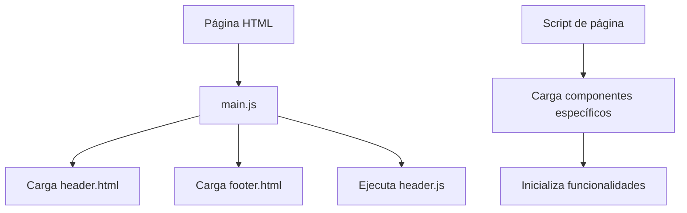

# Documentación Técnica - Proyecto "Evolución"

## 📋 Resumen del Proyecto

**Evolución** es un sitio web moderno y responsive para una empresa especializada en arqueología y restauración de patrimonio cultural. El proyecto presenta una arquitectura modular escalable que permite una fácil mantenibilidad y expansión futura.

**Propósito**: Mostrar los servicios, proyectos y equipo de expertos de la empresa, proporcionando una experiencia de usuario intuitiva y visualmente atractiva.

---

## 🛠️ Pila Tecnológica

- **Frontend**: HTML5 semántico, CSS3 con variables nativas, JavaScript ES6+
- **Arquitectura**: Modular con componentes dinámicos
- **Estilos**: Sistema de diseño con variables CSS
- **JavaScript**: Módulos ES6, Fetch API, Intersection Observer
- **Responsive**: Design mobile-first

---

## 📁 Estructura de Archivos

```
evolucion/
│
├── index.html                          # Página de inicio
├── proyectos.html                      # Galería de proyectos
├── proyecto-detalle.html               # Detalle de proyecto individual
│
├── partials/                           # Componentes HTML modulares
│   ├── header.html                     # Encabezado global
│   ├── hero.html                       # Sección principal
│   ├── acerca.html                     # Sección "Acerca de nosotros"
│   ├── contacto.html                   # Formulario de contacto
│   └── footer.html                     # Pie de página
│
└── assets/
    ├── css/
    │   ├── main.css                    # Archivo principal de estilos
    │   ├── reset.css                   # Reset CSS normalizado
    │   ├── variables.css               # Sistema de diseño
    │   ├── global.css                  # Estilos base
    │   └── components/                 # Estilos por componente
    │       ├── header.css
    │       ├── hero.css
    │       ├── acerca.css
    │       ├── proyectos.css
    │       ├── proyecto-detalle.css
    │       ├── home.css
    │       └── footer.css
    │
    ├── js/
    │   ├── main.js                     # Script principal
    │   ├── components/                 # Componentes reutilizables
    │   │   ├── header.js               # Lógica del header
    │   │   ├── acerca.js               # Línea de tiempo
    │   │   └── proyecto-detalle.js     # Detalle de proyecto
    │   ├── pages/                      # Scripts específicos por página
    │   │   ├── home.js                 # Página de inicio
    │   │   ├── projects.js             # Galería de proyectos
    │   │   └── project-detail.js       # Detalle de proyecto
    │   └── data/
    │       └── proyectosData.js        # Datos de proyectos
    │
    └── images/                         # Recursos multimedia
```

---

## 🧩 Componentes y Funcionalidades

### ✅ **Base del CSS - Sistema de Diseño**

**Archivo**: `assets/css/variables.css`

**Descripción**: Sistema completo de variables CSS que define la identidad visual del proyecto.

**Características**:
- Paleta de colores temática (tierra, piedra, oro antiguo)
- Escala tipográfica modular
- Sistema de espaciado consistente
- Variables para sombras y bordes

**Uso**:
```css
.elemento {
    color: var(--color-primario);
    font-family: var(--font-principal);
    margin-bottom: var(--space-4);
}
```

### ✅ **Header Global - Navegación Inteligente**

**Archivos**: `partials/header.html`, `assets/js/components/header.js`, `assets/css/components/header.css`

**Estado**: ✅ Terminado y funcionando en todas las páginas

**Funcionalidades**:
- **Navegación fija** con efecto de scroll
- **Menú móvil** responsive con animación hamburguesa
- **Navegación por anclas inteligente**: Redirige a `index.html` si es necesario
- **Detección automática** de página actual

**Lógica centralizada**: Toda la funcionalidad del header está en `header.js`, cargada desde `main.js` después de renderizar el HTML.

### ✅ **Hero Section - Impacto Visual**

**Archivos**: `partials/hero.html`, `assets/css/components/hero.css`

**Estado**: ✅ Terminado con animaciones mejoradas

**Características**:
- **Diseño de pantalla completa** (100vh)
- **Imagen de fondo** con overlay semitransparente
- **Animaciones de entrada** escalonadas (fade-in, slide-up)
- **Botones interactivos** con efectos hover avanzados

**Efectos de botones**:
- **Botón principal**: Levantamiento y sombra intensificada
- **Botón secundario**: Relleno con color de acento
- **Transiciones suaves** con curvas de easing personalizadas

### ✅ **Sección "Acerca de" - Historia Interactiva**

**Archivos**: `partials/acerca.html`, `assets/js/components/acerca.js`, `assets/css/components/acerca.css`

**Estado**: ✅ Terminado con sección de equipo añadida

**Componentes**:

#### **Línea de Tiempo Interactiva**
- **Animaciones al scroll** con Intersection Observer
- **Sistema de filtros** por categoría (Arqueología, Restauración, Investigación)
- **Diseño responsive** que se adapta a móvil

#### **Nueva Sección: Equipo de Expertos**
- **Grid responsivo** de perfiles (4→2→1 columnas)
- **Tarjetas interactivas** con efecto hover
- **Fotos circulares** con borde decorativo
- **Animaciones de entrada** escalonadas

### ✅ **Galería de Proyectos - Vista Flexible**

**Archivos**: `proyectos.html`, `assets/js/pages/projects.js`, `assets/css/components/proyectos.css`

**Estado**: ✅ Terminado con sistema de vistas dual

**Funcionalidades**:

#### **Sistema de Vistas**
- **Vista Grid**: Cuadrícula tradicional de tarjetas
- **Vista Lista**: Diseño horizontal con más información
- **Persistencia**: Guarda preferencia del usuario en localStorage

#### **Carga Dinámica**
- **Datos desde** `proyectosData.js`
- **Renderizado automático** de tarjetas
- **Navegación a detalles** con parámetros URL

### ✅ **Página de Detalle de Proyecto - Experiencia Inmersiva**

**Archivos**: `proyecto-detalle.html`, `assets/js/pages/project-detail.js`, `assets/css/components/proyecto-detalle.css`

**Estado**: ✅ Terminado con slider interactivo

**Características**:

#### **Carga Dinámica desde URL**
```javascript
// Lee parámetro ID de la URL
const urlParams = new URLSearchParams(window.location.search);
const projectId = urlParams.get('id');
```

#### **Slider "Antes/Después" Interactivo**
- **Control deslizante** con input range
- **Superposición de imágenes** con CSS positioning
- **Efecto visual** de revelación progresiva

#### **Galería Integrada**
- Muestra imágenes adicionales del proyecto
- Carga lazy para optimización de rendimiento

---

## 🔧 Guía de Mantenimiento

### 📝 Añadir un Nuevo Proyecto

**Archivo**: `assets/js/data/proyectosData.js`

**Proceso**:
1. Abrir el archivo `proyectosData.js`
2. Añadir un nuevo objeto al array `projectsData`:

```javascript
{
    id: 4, // ID único incremental
    title: "Nombre del Proyecto",
    category: "Arqueología", // o "Restauración" o "Investigación"
    description: "Descripción breve del proyecto",
    fullDescription: "Descripción completa con detalles...",
    image: "url/imagen-principal.jpg",
    beforeImage: "url/estado-antiguo.jpg",
    afterImage: "url/estado-actual.jpg",
    year: "2024",
    location: "Ubicación del proyecto",
    duration: "6 meses",
    client: "Cliente o institución",
    gallery: [
        "url/imagen-extra-1.jpg",
        "url/imagen-extra-2.jpg"
    ]
}
```

3. El proyecto aparecerá automáticamente en la galería y será accesible en `proyecto-detalle.html?id=4`

### 🎨 Modificar Contenido Existente

#### **Textos e Imágenes del Header/Footer**
- **Archivos**: `partials/header.html` y `partials/footer.html`
- Los cambios se reflejarán en todas las páginas automáticamente

#### **Contenido de la Página de Inicio**
- **Hero section**: `partials/hero.html`
- **Sección acerca**: `partials/acerca.html` 
- **Formulario contacto**: `partials/contacto.html`

#### **Estilos Visuales**
- **Colores y tipografía**: `assets/css/variables.css`
- **Estilos específicos**: Archivos en `assets/css/components/`

### 🚀 Añadir una Nueva Página

**Proceso**:
1. Crear archivo HTML en la raíz (ej: `servicios.html`)
2. Usar la estructura base con contenedores para header/footer
3. Crear script específico en `assets/js/pages/servicios.js`
4. Añadir estilos en `assets/css/components/servicios.css`
5. Importar estilos en `assets/css/main.css`

### 🔄 Flujo de Carga de Componentes



---

## 🐛 Solución de Problemas Comunes

### **Header no funciona en páginas secundarias**
- Verificar que `header.js` se esté cargando desde `main.js`
- Confirmar que los enlaces usen anclas simples (`href="#contacto"`)

### **Proyectos no se muestran en la galería**
- Revisar la consola del navegador para errores
- Verificar que `projectsData.js` exporte correctamente el array
- Confirmar que los IDs en los datos sean únicos

### **Slider antes/después no funciona**
- Verificar que las imágenes tengan URLs válidas
- Confirmar que los elementos tengan los IDs correctos
- Revisar la consola para errores JavaScript

---

## 📱 Compatibilidad y Rendimiento

- **Navegadores compatibles**: Chrome 90+, Firefox 88+, Safari 14+, Edge 90+
- **Optimizaciones**: Lazy loading de imágenes, CSS minimizado, JavaScript modular
- **Accesibilidad**: Navegación por teclado, contraste adecuado, semántica HTML5

---

## 🔮 Próximas Mejoras Potenciales

1. **Sistema de blogging** integrado
2. **Formulario de contacto** funcional con backend
3. **Galería de imágenes** modal y lightbox
4. **Modo oscuro** alternativo
5. **Internacionalización** (i18n) para múltiples idiomas

---

**Última actualización**: Diciembre 2024  
**Versión del proyecto**: 1.0.0  
**Desarrollado por**: Equipo Evolución